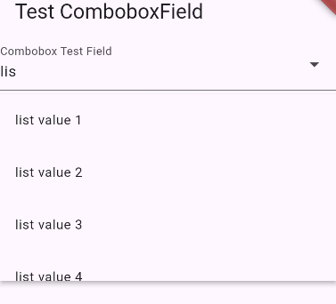

# Time Table Management
Manage Your TimeTable like never before, so ditch your Excel like TimeTable and get bettter management at no cost.

This prrogram is being developed to be integrated to another application `[github link will be pasted here once ready]`

## Details
- `OS:` Android
- `Programming Language:` Dart 
- `Framework:` Flutter

## ComboboxField (A new component developed specifically for this application)

The ComboboxFeild widget requires 3 parameters
- label (data of type `String`)
- options (data of the type `List<String>`) REQUIRED
- controller (`TextEditingController`) REQUIRED

This is an image of the ComboboxField in action:

